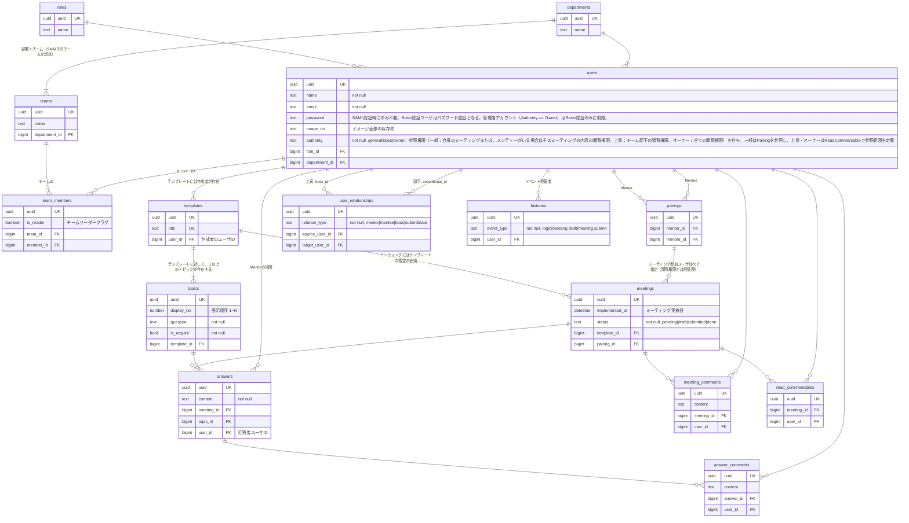

```mermaid
erDiagram

%% 各テーブルは bigint id PKを所持
%% 各テーブルは created_at, updated_at, deleted_atを所持
%% tables { bigint id PK, datetime created_at, datetime updated_at, deleted_at } が存在する前提とする。
%% pending|draft|submitted|done / general|boss|owner / mentor|mentee|boss|subordinate / login|meeting.draft|meeting.submit は Domain Value Object（列挙体）。マスタテーブルは持たない。

%% ユーザ系
users {
    uuid uuid UK
    text name "not null"
    text email "not null"
    text password "SAML認証時にのみ不要。Basic認証ユーザはパスワード認証となる。管理者アカウント（Authority == Owner）はBasic認証のみに制限。"
    text image_uri "イメージ画像の保存先"
    text authority "not null, general|boss|owner。参照権限（一般：自身のミーティングまたは、メンティーがいる場合はそのミーティングの内容の閲覧権限、上長：チーム配下の閲覧権限、オーナー：全ての閲覧権限）を付与。一般はPairingを参照し、上長・オーナーはReadCommentableで参照範囲を定義"

    bigint role_id FK
    bigint department_id FK
}
roles ||--o{ users: ""
departments ||--|{ users: ""

team_members {
    uuid uuid UK
    boolean is_reader "チームリーダーフラグ"

    bigint team_id FK
    bigint member_id FK
}
teams ||--o{ team_members: "チームID"
users ||--o{ team_members: "メンバーID"

departments {
    uuid uuid UK
    text name
}

roles {
    uuid uuid UK
    text name
}

teams {
    uuid uuid UK
    text name

    bigint department_id FK
}
departments ||--|{ teams: "部署＞チーム（SM以下のチームを想定）"

pairings {
    uuid uuid UK

    bigint mentor_id FK
    bigint mentee_id FK
}
users ||--o{ pairings: "Mentor"
users ||--o{ pairings: "Mentee"

%% ミーティング系
%% ステータス submitted, done 以外では他ユーザから見られないようにする
meetings {
    uuid uuid UK
    datetime Implemented_at "ミーティング実施日"
    text status "not null, pending|draft|submitted|done"

    bigint template_id FK
    bigint pairing_id FK
}
templates ||--o{ meetings: "ミーティングにはテンプレートの指定が必須"
pairings ||--o{ meetings: "ミーティング参加ユーザはペア指定（閲覧権限とは別管理）"

templates {
    uuid uuid UK
    text title UK

    bigint user_id FK "作成者のユーザID"
}
users ||--o{ templates: "テンプレートには作成者が存在"

topics {
    uuid uuid UK
    number display_no "表示順序 1~N"
    text question "not null"
    bool is_require "not null"

    bigint template_id FK
}
templates ||--|{ topics: "テンプレートに対して、１以上のトピックが存在する"

answers {
    uuid uuid UK
    text content "not null"

    bigint meeting_id FK
    bigint topic_id FK
    bigint user_id FK "回答者ユーザID"
}
meetings ||--o{ answers: ""
topics ||--o{ answers: ""
users ||--o{ answers: "Mentorの回答"

meeting_comments {
    uuid uuid UK
    text content

    bigint meeting_id FK
    bigint user_id FK
}
meetings ||--o{ meeting_comments: ""
users ||--o{ meeting_comments: ""

answer_comments {
    uuid uuid UK
    text content

    bigint answer_id FK
    bigint user_id FK
}
answers ||--o{ answer_comments: ""
users ||--o{ answer_comments: ""

%% 権限系
%% 上長や部署長、管理者などのミーティング当事者以外からの閲覧権限を管理する（メンターはReadWriteCommentableのため別管理（Pairingテーブル管理））、一時的な閲覧権限付与なども想定。
read_commentables {
    uuid uuid UK

    bigint meeting_id FK
    bigint user_id FK
}
meetings ||--o{ read_commentables: ""
users ||--o{ read_commentables: ""

%% 上司-部下、メンター-メンティーの関係性を設定、これを元にread_commentablesを設定する？
user_relationships {
    uuid uuid UK
    text relation_type "not null, mentor|mentee|boss|subordinate"

    bigint source_user_id FK
    bigint target_user_id FK
}
users ||--o{ user_relationships: "上司, boss_id"
users ||--o{ user_relationships: "部下, subordinate_id"

histories {
    uuid uuid UK
    text event_type "not null, login|meeting.draft|meeting.submit"

    bigint user_id FK
}
users ||--o{ histories: "イベント発報者"
```
