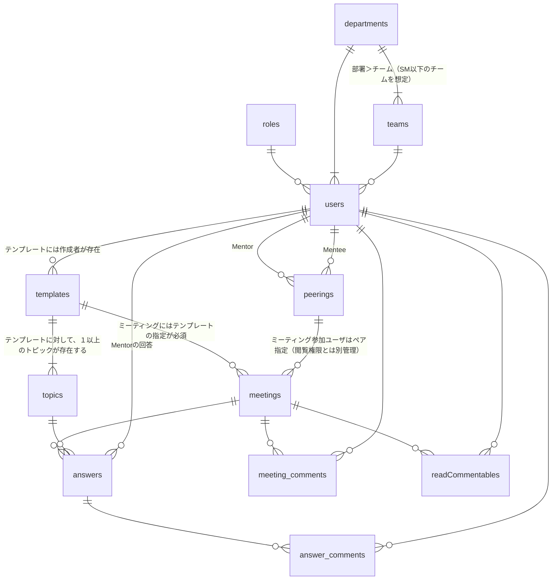

```mermaid
erDiagram
%% 各テーブルは bigint id PKを所持
%% 各テーブルは created_at, updated_at, deleted_atを所持
%% tables { bigint id PK, datetime created_at, datetime updated_at, datetime deleted_at } が存在する前提とする。

%% ユーザ系
users {
}
roles ||--o{ users: ""
departments ||--|{ users: ""
teams ||--o{ users: ""

departments {}
roles {}
teams {}
departments ||--|{ teams: "部署＞チーム（SM以下のチームを想定）"

peerings {}
users ||--o{ peerings: "Mentor"
users ||--o{ peerings: "Mentee"

%% ミーティング系
meetings {}
templates ||--o{ meetings: "ミーティングにはテンプレートの指定が必須"
peerings ||--o{ meetings: "ミーティング参加ユーザはペア指定（閲覧権限とは別管理）"

templates {}
users ||--o{ templates: "テンプレートには作成者が存在"

topics {}
templates ||--|{ topics: "テンプレートに対して、１以上のトピックが存在する"

answers {}
meetings ||--o{ answers: ""
topics ||--o{ answers: ""
users ||--o{ answers: "Mentorの回答"

meeting_comments {}
meetings ||--o{ meeting_comments: ""
users ||--o{ meeting_comments: ""

answer_comments {}
answers ||--o{ answer_comments: ""
users ||--o{ answer_comments: ""

%% 権限系
readCommentables {}
meetings ||--o{ readCommentables: ""
users ||--o{ readCommentables: ""

```