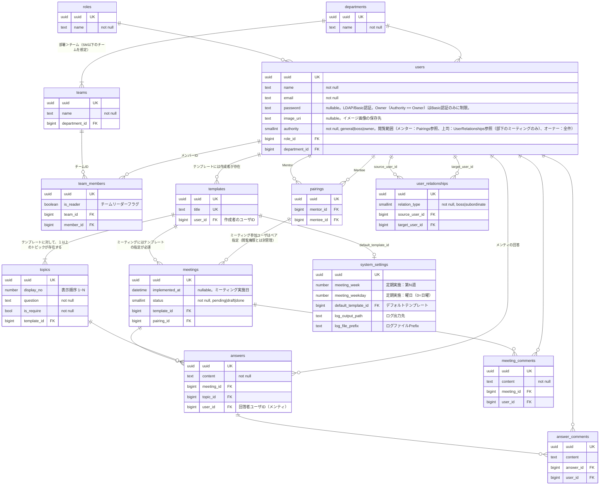

```mermaid
erDiagram

%% 各テーブルは bigint id PKを所持
%% 各テーブルは created_at, updated_at, deleted_atを所持
%% tables { bigint id PK, datetime created_at, datetime updated_at, deleted_at } が存在する前提とする。
%% pending|draft|done / general|boss|owner / boss|subordinate は Domain Value Object（列挙体）。マスタテーブルは持たない。
%% VO列は smallint で保持する。

%% ユーザ系
users {
    uuid uuid UK
    text name "not null"
    text email "not null"
    text password "nullable。LDAP/Basic認証。Owner（Authority == Owner）はBasic認証のみに制限。"
    text image_uri "nullable。イメージ画像の保存先"
    smallint authority "not null, general|boss|owner。閲覧範囲（メンター：Pairings参照、上司：UserRelationships参照（部下のミーティングのみ）、オーナー：全件）"

    bigint role_id FK
    bigint department_id FK
}
roles ||--o{ users: ""
departments ||--|{ users: ""

team_members {
    uuid uuid UK
    boolean is_reader "チームリーダーフラグ"

    bigint team_id FK
    bigint member_id FK
}
teams ||--o{ team_members: "チームID"
users ||--o{ team_members: "メンバーID"

departments {
    uuid uuid UK
    text name "not null"
}

roles {
    uuid uuid UK
    text name "not null"
}

teams {
    uuid uuid UK
    text name "not null"

    bigint department_id FK
}
departments ||--|{ teams: "部署＞チーム（SM以下のチームを想定）"

pairings {
    uuid uuid UK

    bigint mentor_id FK
    bigint mentee_id FK
}
%% pairings: 1on1ミーティングの参加ペア（メンター-メンティ）を管理。ミーティング作成・メンター閲覧の基準。
users ||--o{ pairings: "Mentor"
users ||--o{ pairings: "Mentee"

%% ミーティング系
%% ステータス done 以外では他ユーザから見られないようにする
meetings {
    uuid uuid UK
    datetime implemented_at "nullable。ミーティング実施日"
    smallint status "not null, pending|draft|done"

    bigint template_id FK
    bigint pairing_id FK
}
templates ||--o{ meetings: "ミーティングにはテンプレートの指定が必須"
pairings ||--o{ meetings: "ミーティング参加ユーザはペア指定（閲覧権限とは別管理）"

templates {
    uuid uuid UK
    text title UK

    bigint user_id FK "作成者のユーザID"
}
users ||--o{ templates: "テンプレートには作成者が存在"

topics {
    uuid uuid UK
    number display_no "表示順序 1~N"
    text question "not null"
    bool is_require "not null"

    bigint template_id FK
}
templates ||--|{ topics: "テンプレートに対して、１以上のトピックが存在する"

answers {
    uuid uuid UK
    text content "not null"

    bigint meeting_id FK
    bigint topic_id FK
    bigint user_id FK "回答者ユーザID（メンティ）"
}
meetings ||--o{ answers: ""
topics ||--o{ answers: ""
users ||--o{ answers: "メンティの回答"

meeting_comments {
    uuid uuid UK
    text content "not null"

    bigint meeting_id FK
    bigint user_id FK
}
meetings ||--o{ meeting_comments: ""
users ||--o{ meeting_comments: ""

answer_comments {
    uuid uuid UK
    text content

    bigint answer_id FK
    bigint user_id FK
}
answers ||--o{ answer_comments: ""
users ||--o{ answer_comments: ""

%% user_relationships: 上司-部下の組織関係を管理。pairings とは役割が異なる（mentor-mentee は pairings で管理）。
user_relationships {
    uuid uuid UK
    smallint relation_type "not null, boss|subordinate"

    bigint source_user_id FK
    bigint target_user_id FK
}
%% Source側からTargetを見た場合のリレーションを記述
%% 例: RelationType=Boss, source_user_id=SubordinateID, target_user_id=BossID
users ||--o{ user_relationships: "source_user_id"
users ||--o{ user_relationships: "target_user_id"

system_settings {
    uuid uuid UK
    number meeting_week "定期実施：第N週"
    number meeting_weekday "定期実施：曜日（0=日曜）"
    bigint default_template_id FK "デフォルトテンプレート"
    text log_output_path "ログ出力先"
    text log_file_prefix "ログファイルPrefix"
}
templates ||--o| system_settings: "default_template_id"
```
