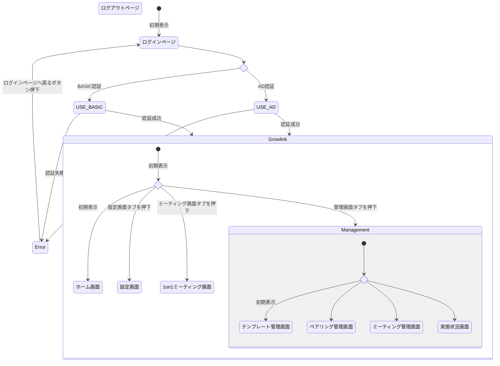

```mermaid
stateDiagram-v2

LoginPage: ログインページ
LogoutPage: ログアウトページ

state login_method <<choice>>

[*] --> LoginPage: 初期表示
LoginPage --> login_method
login_method --> USE_AD: AD認証
login_method --> USE_BASIC: BASIC認証

USE_AD --> Error: 認証失敗
USE_BASIC --> Error: 認証失敗
Error --> LoginPage: ログインページへ戻るボタン押下

USE_AD --> Growlink: 認証成功
USE_BASIC --> Growlink: 認証成功

state Growlink {
    Home: ホーム画面
    Setting: 設定画面
    Meeting: 1on1ミーティング画面
    state view_select <<choice>>

    [*] --> view_select:初期表示
    view_select --> Home: 初期表示
    view_select --> Setting: 設定画面タブを押下
    view_select --> Meeting: ミーティング画面タブを押下
    view_select --> Management: 管理画面タブを押下

    state Management {
        MngTemplate: テンプレート管理画面
        MngPeering: ペアリング管理画面
        MngMeeting: ミーティング管理画面
        MngProgress: 実施状況画面
        state mng_view_select <<choice>>

        [*] --> mng_view_select
        mng_view_select --> MngTemplate: 初期表示
        mng_view_select --> MngPeering
        mng_view_select --> MngMeeting
        mng_view_select --> MngProgress
    }
}
```