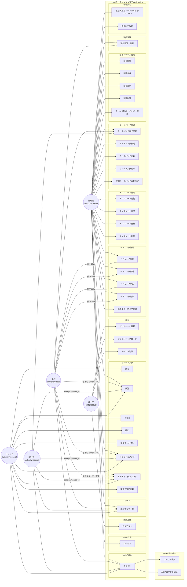

# ユースケース図

ユーザ要求に対するシステムの振る舞い。sudo モデリングの U。画面遷移の参考は `doc/model/old/statedisplaytransition.md`。

```mermaid
graph LR

user((ユーザ\n（全権限共通）))

mentee((メンティ\nauthority=general))
mentor((メンター\nauthority=general))
boss((上司\nauthority=boss))
owner((管理者\nauthority=owner))

subgraph growlink["1on1ミーティングシステム Growlink"]
    subgraph ldap["LDAP認証"]
        ldap_login[ログイン]
    end

    subgraph basic["Basic認証"]
        basic_login[ログイン]
    end

    subgraph auth_common["認証共通"]
        logout[ログアウト]
    end

    subgraph home_uc["ホーム"]
        read_meeting_summary[面談サマリ一覧]
    end

    subgraph meetings["ミーティング"]
        answer[回答]
        read[閲覧]
        draft[下書き]
        submit[提出]
        cancel_submit[提出キャンセル]
        answer_comment[トピックコメント]
        meeting_comment[ミーティングコメント]
        update_meeting_setting[実施予定日更新]
    end

    subgraph setting["設定"]
        update_profile[プロフィール更新]
        upload_icon[アイコンアップロード]
        delete_icon[アイコン削除]
    end

    subgraph mng_pairing[ペアリング管理]
        read_pairing[ペアリング閲覧]
        create_pairing[ペアリング作成]
        update_pairing[ペアリング更新]
        delete_pairing[ペアリング削除]
        bulk_pairing_by_department[部署単位一括ペア登録]
    end

    subgraph mng_template[テンプレート管理]
        read_template[テンプレート閲覧]
        create_template[テンプレート作成]
        update_template[テンプレート更新]
        delete_template[テンプレート削除]
    end

    subgraph mng_meeting[ミーティング管理]
        read_meeting_log[ミーティングログ閲覧]
        create_meeting[ミーティング作成]
        update_meeting[ミーティング更新]
        delete_meeting[ミーティング削除]
        auto_create_meeting[定期ミーティング自動作成]
    end

    subgraph mng_department[部署・チーム管理]
        read_department[部署閲覧]
        create_department[部署作成]
        update_department[部署更新]
        delete_department[部署削除]
        manage_team[チーム CRUD・メンバー割当]
    end

    subgraph mng_progress[進捗管理]
        read_progress[進捗閲覧・集計]
    end

    subgraph mng_setting[管理設定]
        update_meeting_schedule[定期実施日・デフォルトテンプレート]
        update_log_setting[ログ出力設定]
    end
end

subgraph LDAPServer["LDAPサーバー"]
    search[ユーザー検索]
    ad_login[ADアカウント認証]
end

mentee ~~~ mentor
mentor ~~~ boss
boss ~~~ owner

%% メンティ
mentee --> read_meeting_summary
mentee --> answer
mentee --> read
mentee --> draft
mentee --> submit
mentee --> cancel_submit
mentee --> answer_comment
mentee --> meeting_comment
mentee --> update_meeting_setting

%% メンター（pairings で mentor に指定されている場合: 閲覧・コメント）
mentor --> read_meeting_summary
mentor -->|pairings.mentor_id| read
mentor -->|pairings.mentor_id| answer_comment
mentor -->|pairings.mentor_id| meeting_comment
mentor --> read_meeting_log

%% 上司（user_relationships で部下に指定されている場合: 閲覧・コメント）
boss --> read_meeting_summary
boss -->|部下のミーティング| read
boss -->|部下のミーティング| answer_comment
boss -->|部下のミーティング| meeting_comment
boss --> read_meeting_log
boss -->|部下のみ| read_pairing
boss -->|部下のみ| create_pairing
boss -->|部下のみ| update_pairing
boss -->|部下のみ| delete_pairing
boss --> read_progress

%% 管理者
owner --> read_meeting_summary
owner --> read
owner --> answer_comment
owner --> meeting_comment
owner --> read_pairing
owner --> create_pairing
owner --> update_pairing
owner --> delete_pairing
owner --> bulk_pairing_by_department
owner --> read_template
owner --> create_template
owner --> update_template
owner --> delete_template
owner --> read_meeting_log
owner --> create_meeting
owner --> update_meeting
owner --> delete_meeting
owner --> auto_create_meeting
owner --> read_department
owner --> create_department
owner --> update_department
owner --> delete_department
owner --> manage_team
owner --> read_progress
owner --> update_meeting_schedule
owner --> update_log_setting

%% 認証
mentee --> ldap_login
mentor --> ldap_login
boss --> ldap_login
ldap_login --> search
ldap_login --> ad_login
owner --> basic_login
owner -.-> ldap_login

user --> logout
user --> update_profile
user --> upload_icon
user --> delete_icon

%% --- ユースケース詳細（テキスト補足） ---

%% UC-01 ログイン（LDAP）
%% アクター: mentee / mentor / boss
%% 主成功: POST /api/v1/login（ldap）→ LDAP Search + Authenticate → セッション発行 → GET /
%% 代替: 認証失敗 → /login

%% UC-02 ログイン（Basic）
%% アクター: owner（password を持つユーザ）
%% 主成功: POST /api/v1/login（basic）→ users.password 照合 → セッション発行
%% 注: authority=owner は Basic ログインに制限する運用

%% UC-03 ログアウト
%% アクター: 全ログインユーザ
%% 主成功: GET /logout → セッション破棄 → 3 秒後 /login

%% UC-04 面談サマリ（ホーム）
%% アクター: 全ログインユーザ（表示範囲は権限でスコープ）
%% 主成功: GET / → pairings + meetings.status による一覧投影
%% Phase1: T03

%% UC-05 ミーティング回答・提出
%% アクター: メンティ（pairings.mentee_id）
%% 下書き: POST /api/v1/meeting/:uuid/draft（status: draft）
%% 提出: POST /api/v1/meeting/:uuid（status: draft → done。submitted は使わない）
%% 提出キャンセル: POST /api/v1/meeting/:uuid/draft/cancel（done → draft）

%% UC-06 コメント
%% トピック: POST/PUT/DELETE /api/v1/meeting/:uuid/comment/:topic_uuid
%% ミーティング: POST/PUT/DELETE /api/v1/meeting/:uuid/meeting-comment[/:comment_uuid]
%% 閲覧権限: メンティ本人、pairings のメンター、user_relationships の上司、owner

%% UC-07 設定・アイコン
%% PUT /api/v1/setting、POST/DELETE /api/v1/setting/icon（users.image_uri）

%% UC-08 管理 API 共通
%% プレフィックス: /api/v1/management/*
%% 削除: 確認モーダル確定時のみ DELETE。削除ボタン押下で GET は発行しない

%% UC-09 ペアリング
%% CRUD: /api/v1/management/pairing[/:uuid]
%% 部署単位画面: /management/pairing/department/*（部署管理タブとは無関係。部署単位でペア決定）
%% 一括登録: PUT /api/v1/management/pairing/department/:uuid（チーム/SM 単位 bulk）Phase1: T09
%% 編集 URL: /management/pairing/:uuid/edit（create と分離）

%% UC-10 テンプレート・デフォルト
%% CRUD: /api/v1/management/template[/:uuid]
%% デフォルト: system_settings.default_template_id（管理設定タブ）Phase1: T06

%% UC-11 ミーティング管理・定期作成
%% CRUD: /api/v1/management/meeting[/:uuid]、ログ: GET .../meeting/log
%% 定期作成: system_settings の週・曜日 + cron → meetings 生成 Phase1: T02

%% UC-12 部署・チーム
%% 部署 CRUD: /api/v1/management/department[/:uuid] 等
%% チーム: /api/v1/management/team[/:uuid]、リーダー/メンバー割当 API

%% UC-13 進捗
%% アクター: boss / owner のみ（/management/progress）
%% meetings.status を department / team / pairing 単位で集計 Phase1: T05

%% UC-14 管理設定
%% PUT /api/v1/management/setting/meeting（meeting_week, meeting_weekday, default_template_id）
%% PUT /api/v1/management/setting/log（log_output_path, log_file_prefix）

%% 管理画面タブ可視性（ナビ）
%% Owner: 全タブ（ペアリング・テンプレート・ミーティング・部署・チーム・管理設定）
%% Boss: 進捗 + ミーティングログ + 部下範囲のペアリング（user_relationships 参照）
%% Mentor: メンティのミーティングログ閲覧のみ（management 入口はあるがタブ内容が制限）

%% Out of scope（Phase1 外）
%% - リマインド通知（T01）
%% - メンターによるペア解消の独立 UC（論理削除で足りる T04）
%% - 完了承認の二段階（T07）
%% - 監査ログ CSV エクスポート（T08）
%% - histories / read_commentables テーブル
```
