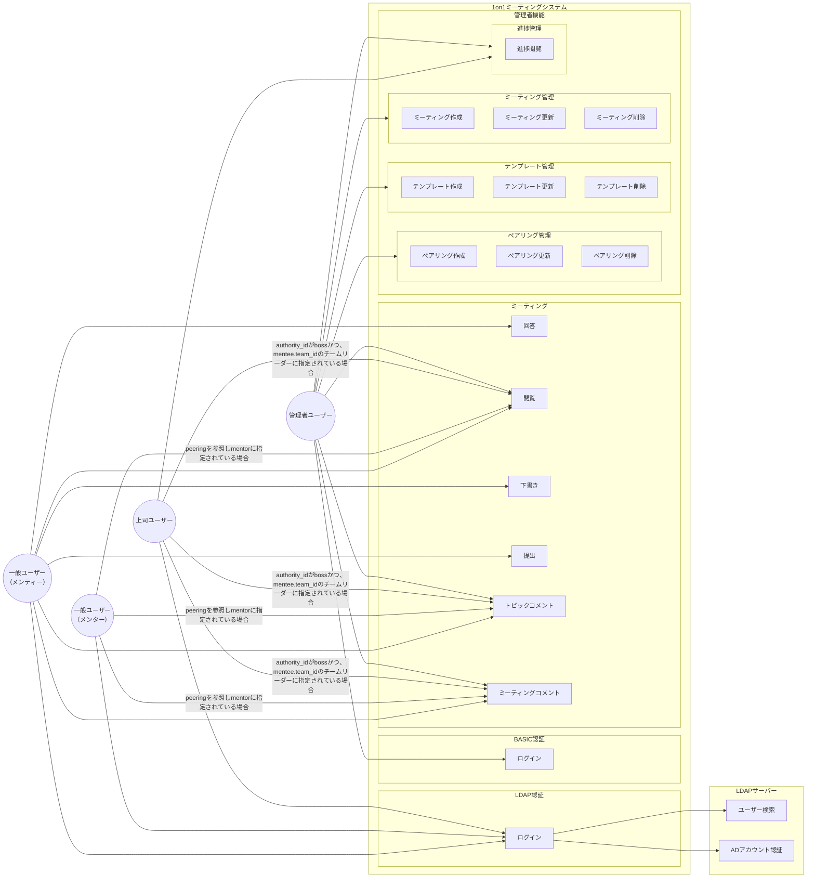

```mermaid
graph LR;

mentee((一般ユーザー\n（メンティー）))
mentor((一般ユーザー\n（メンター）))
boss((上司ユーザー))
owner((管理者ユーザー))

subgraph growlink["1on1ミーティングシステム"]
    subgraph ldap["LDAP認証"]
        ldap_login[ログイン]
    end

    subgraph basic["BASIC認証"]
        basic_login[ログイン]
    end

    subgraph meetings["ミーティング"]
        answer[回答]
        read[閲覧]
        draft[下書き]
        submit[提出]
        topic_comment[トピックコメント]
        meeting_comment[ミーティングコメント]
    end

    subgraph management["管理者機能"]
        subgraph mng_peering[ペアリング管理]
            create_peering[ペアリング作成]
            update_peering[ペアリング更新]
            delete_peering[ペアリング削除]
        end

        subgraph mng_template[テンプレート管理]
            create_template[テンプレート作成]
            update_template[テンプレート更新]
            delete_template[テンプレート削除]
        end

        subgraph mng_meeting[ミーティング管理]
            create_meeting[ミーティング作成]
            update_meeting[ミーティング更新]
            delete_meeting[ミーティング削除]
        end

        subgraph mng_progress[進捗管理]
            read_progress[進捗閲覧]
        end
    end
end

subgraph LDAPServer["LDAPサーバー"]
    search[ユーザー検索]
    ad_login[ADアカウント認証]
end

mentee ~~~ mentor
mentor ~~~ boss
boss ~~~ owner

mentee --> answer
mentee --> read
mentee --> draft
mentee --> submit
mentee --> topic_comment
mentee --> meeting_comment

mentor -->|peeringを参照しmentorに指定されている場合| read
mentor -->|peeringを参照しmentorに指定されている場合| topic_comment
mentor -->|peeringを参照しmentorに指定されている場合| meeting_comment

boss -->|authority_idがbossかつ、mentee.team_idのチームリーダーに指定されている場合| read
boss -->|authority_idがbossかつ、mentee.team_idのチームリーダーに指定されている場合| topic_comment
boss -->|authority_idがbossかつ、mentee.team_idのチームリーダーに指定されている場合| meeting_comment
boss --> mng_progress

owner --> read
owner --> topic_comment
owner --> meeting_comment
owner --> mng_peering
owner --> mng_meeting
owner --> mng_template
owner --> mng_progress

mentee --> ldap_login
mentor --> ldap_login
boss --> ldap_login
ldap_login --> search
ldap_login --> ad_login

owner --> basic_login
```